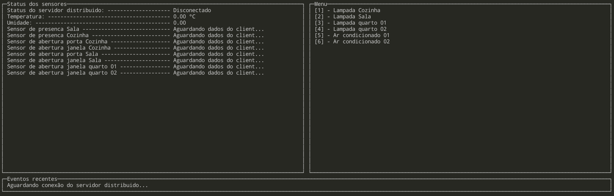

## Projeto 2 - 2020/2 - FSE

__Aluno__: Elias Bernardo Marques Magalhães
__Matrícula__: 150/009011

Este trabalho tem por objetivo a criação de um sistema distribuído de automação residencial para monitoramento e acionamento de sensores e dispositivos. O sistema deve ser desenvolvido para funcionar em um conjunto de placas Raspberry Pi com um servidor central responsável pelo controle e interface com o usuário e servidores distribuídos para leitura e acionamento dos dispositivos. Dentre os dispositivos envolvidos estão o monitoramento de temperatura, sensores de presença, sensores de abertura e fechamento de portas e janelas, acionamento de lâmpadas, aparelhos de ar-condicionado e alarme.

## Compilação e utilização

> Toda a compilação e utilização foi testada na Raspberry via ssh.

### Compilação

Para compilar o trabalho, digite 

    make all

Em um terminal e aguarde a compilação. Assim que ela finalizar, rode o comando

    make run

E siga as instruções de uso.
> Se, por algum motivo o comando make run não funcionar, você pode digitar `./bin/bin` como alternativa.

### Utilização

O servidor central possui um menu com três seções:

A seção __Status dos sensores__ possui dados dos sensores que são enviados (após solicitação ou via push) pelo servidor distribuído. Os sensores possuem três possíveis valores:

- __Aguardando dados do client__: quando o servidor distribuído não está conectado, não sendo possível determiná-los;
- __Ocioso__: quando os sensores não estão detectando nenhum input (valor 0);
- __Detectando__: quando os sensores estão detectando um input (valor 1);

Já a seção __Menu__ permite controlar as lâmpadas e ar-condicionados, bastando pressionar a tecla numérica indicada.

Por fim, a seção __Eventos recentes__ mostra uma mensagem com o evento mais recente ocorrido.

